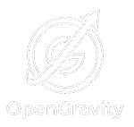
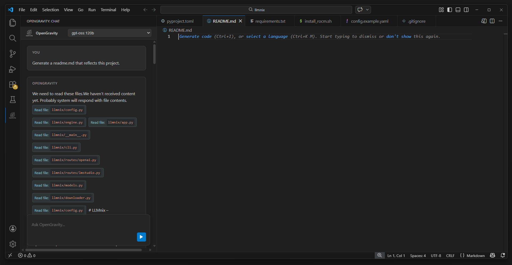
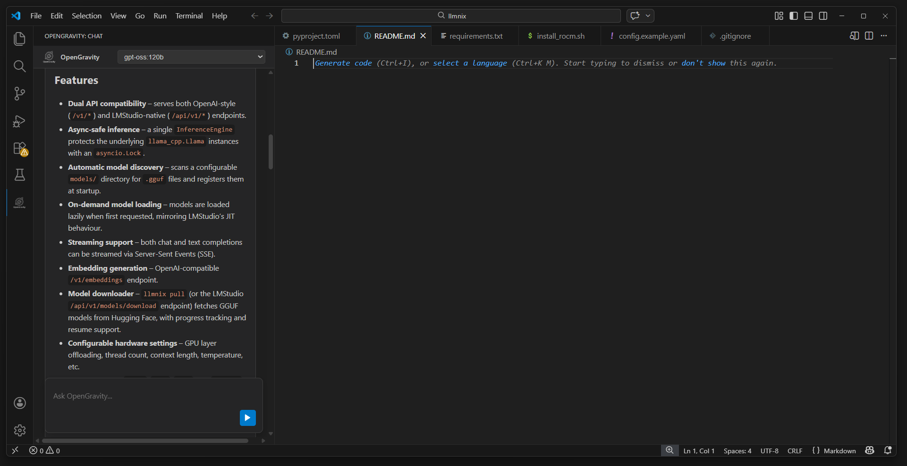
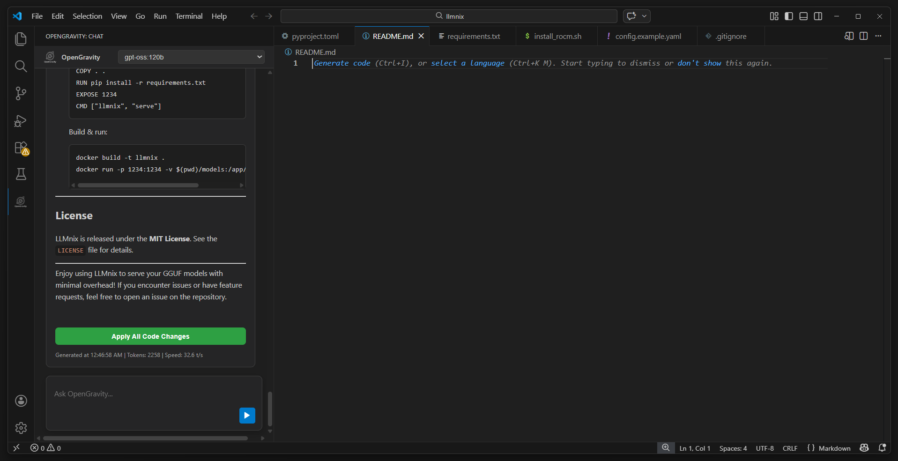
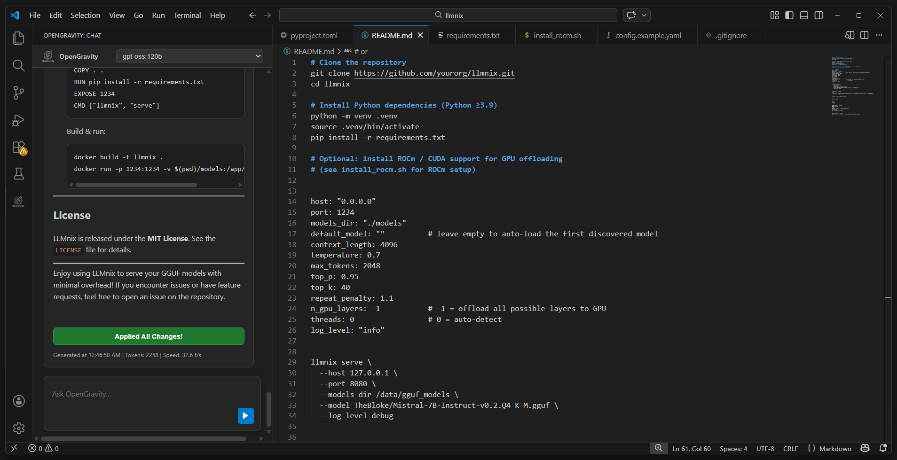

<div align="center">
  
  <h1>OpenGravity</h1>
  <p><strong>A powerful, 100% private AI coding assistant deeply integrated into VS Code.</strong></p>
  <p>Experience the cutting-edge intelligence of GitHub Copilot and Cursor — running entirely on your own hardware.</p>
</div>

---

OpenGravity is a proprietary, locally-hosted AI coding assistant tightly integrated into Visual Studio Code. Powered natively by [llama.cpp](https://github.com/ggerganov/llama.cpp), [Ollama](https://ollama.com/), and [LM Studio](https://lmstudio.ai/), OpenGravity acts as an intelligent agent capable of deep codebase analysis, autonomous file and web research, structured implementation planning, session continuity, and inline autocompletions.

## 🌟 Why OpenGravity?
1. **No usage limits:** Generate as much code as you want.
2. **No outages:** Your AI works 100% offline or on your own remote server.
3. **Total Privacy:** Zero data ever leaves your machine or goes to the cloud.
4. **No monthly costs:** Cancel your $20/mo subscriptions.
5. **Remote GPU support:** Run llama.cpp on a powerful machine elsewhere on your network and connect from any laptop.

## 🚀 Key Features

### 1. The "Clean Box" Interface
OpenGravity features a highly polished, zero-clutter conversational interface natively docked to your Secondary Side Bar. Syntax-highlighted code blocks with one-click copy, plan approval flows, and apply-to-file buttons are built directly into the chat.



### 2. Autonomous Context Gathering
Never copy-paste code again. OpenGravity automatically includes your open files, workspace file tree, **active editor cursor position**, and any **selected text** as context on every request — so the agent always knows exactly where you are and what you're looking at.



### 3. Structured Implementation Plans
Switch to **Plan mode** to make the agent produce a structured implementation plan before touching any code. Review and approve it before execution — giving you full control over architecture decisions.



### 4. One-Click Code Application
The agent labels every code block with its target file path (`**\`src/path/to/file.ts\`**`) immediately above the fence. A single click on **Apply All Code Changes** writes all files directly to disk using `vscode.workspace.fs` — reliable for files of any size. Individual **Copy** buttons appear on every code block for grabbing snippets.



### 5. PLAN.md — Session Continuity
For every task that involves file changes, the agent automatically creates or updates `PLAN.md` in your workspace root. It records:
- **Goal** — what was requested
- **Done** — files created or modified
- **Status** — Completed / In Progress / Blocked
- **Next** — remaining steps if interrupted
- **Notes** — assumptions and decisions

On the next session, the agent reads `PLAN.md` first so it can resume exactly where it left off — no context lost between conversations.

### 6. Live Agent Status
While the agent is working, the chat panel shows its current action in real time — *Reading src/utils.ts…*, *Searching for "authMiddleware"…*, *Fetching docs.example.com…* — so you always know what is happening under the hood.

### 7. Web Fetch Tool
When enabled, the agent can retrieve content from any `http://` or `https://` URL — documentation pages, API specs, GitHub raw files, package READMEs — and use it as context for the task. HTML is automatically stripped to clean plain text.

### 8. New Chat / Clear History
A dedicated **New** button in the header clears the conversation and resets agent memory instantly, without reloading VS Code. Also available via **OpenGravity: Clear Chat History** in the Command Palette.

## ⚡ Additional Capabilities

- **llama.cpp Remote Support:** Point OpenGravity at a llama.cpp server on another machine — ideal for a powerful desktop GPU accessed from a laptop.
- **Ollama & LM Studio Support:** Full native Ollama API and OpenAI-compatible LM Studio support.
- **Inline Ghost Text:** As-you-type code completions using your local model, right inside the editor.
- **Vision Model Support:** Paste or attach images to prompt vision-capable models like `llava`.
- **Native Function Calling:** Uses the model's native tool dispatch when supported, with automatic XML fallback for models that don't.
- **Unified Diff Patching:** Surgical multi-file patches in a single step — no full rewrites needed.
- **Instant Settings Sync:** All settings changes (model, mode, thinking level, sampling params) take effect immediately — no restart required.

---

## ⚙️ Configuration

All settings are in **Settings > Extensions > OpenGravity** and take effect immediately.

### Provider & URLs

| Setting | Description | Default |
| --- | --- | --- |
| `opengravity.provider` | Backend: `llamacpp`, `ollama`, `lmstudio`, `openaiCompatible` | `llamacpp` |
| `opengravity.llamacppUrl` | llama.cpp server URL — local or remote (e.g. `http://192.168.1.100:8080`) | `http://localhost:8080` |
| `opengravity.ollamaUrl` | Ollama base URL | `http://localhost:11434` |
| `opengravity.lmstudioUrl` | LM Studio base URL | `http://localhost:1234` |
| `opengravity.openaiCompatibleUrl` | Generic OpenAI-compatible base URL | `http://localhost:8000` |
| `opengravity.llamacppApiMode` | `openaiCompat` (chat endpoint) or `native` (/completion) | `openaiCompat` |
| `opengravity.llamacppChatEndpoint` | llama.cpp chat path in OpenAI-compat mode | `/v1/chat/completions` |
| `opengravity.llamacppCompletionEndpoint` | llama.cpp completion path in native mode | `/completion` |

### Model & Generation

| Setting | Description | Default |
| --- | --- | --- |
| `opengravity.model` | Model ID. Leave empty for llama.cpp (server uses whatever is loaded). For Ollama use e.g. `qwen2.5-coder:7b`. | `""` |
| `opengravity.contextLength` | Context window size (`num_ctx` on Ollama) | `16384` |
| `opengravity.maxTokens` | Max generated tokens per turn | `4096` |
| `opengravity.temperature` | Sampling temperature (lower = more deterministic) | `0.15` |
| `opengravity.topP` | Nucleus sampling | `0.9` |
| `opengravity.topK` | Top-K sampling | `40` |
| `opengravity.repeatPenalty` | Repetition penalty (Ollama) | `1.1` |
| `opengravity.presencePenalty` | Presence penalty (OpenAI-compatible backends) | `0` |
| `opengravity.frequencyPenalty` | Frequency penalty (OpenAI-compatible backends) | `0` |
| `opengravity.seed` | Fixed random seed (`-1` = random) | `42` |
| `opengravity.presetProfile` | Active tuning preset | `balanced` |

### Chat Behavior

| Setting | Description | Default |
| --- | --- | --- |
| `opengravity.chatMode` | `execute`, `plan`, or `review` | `execute` |
| `opengravity.thinkingLevel` | Reasoning effort: `off`, `low`, `medium`, `high` | `medium` |
| `opengravity.systemPrompt` | Extra instructions appended to the base system prompt | `""` |

### Agent & Tools

| Setting | Description | Default |
| --- | --- | --- |
| `opengravity.agentMaxSteps` | Max tool-call steps per request. Raise freely — the only real limit is context window size. Complex multi-file tasks often need 20–40. | `25` |
| `opengravity.enableNativeToolCalling` | Use native function calling when supported | `true` |
| `opengravity.maxReadFileBytes` | Max bytes returned by `read_file` per call | `150000` |
| `opengravity.enableTerminalTool` | Allow the agent to run shell commands | `false` |
| `opengravity.terminalCommandTimeoutMs` | Timeout for `run_terminal_command` (ms) | `20000` |
| `opengravity.includeHiddenFilesInList` | Include dotfiles in `list_files` output | `false` |
| `opengravity.enableFetchTool` | Allow the agent to fetch content from URLs | `false` |
| `opengravity.fetchToolTimeoutMs` | Timeout for `fetch_url` and `web_search` requests (ms) | `15000` |
| `opengravity.enableWebSearch` | Allow the agent to search the web | `false` |
| `opengravity.webSearchProvider` | Search provider: `brave` or `searxng` | `brave` |
| `opengravity.braveSearchApiKey` | Brave Search API key (free tier) | `""` |
| `opengravity.searxngUrl` | SearXNG instance base URL | `http://localhost:8888` |

### Autocomplete

| Setting | Description | Default |
| --- | --- | --- |
| `opengravity.enableAutocomplete` | Enable inline ghost-text completion | `true` |
| `opengravity.autocompleteContextLength` | Characters of prefix context sent to the model | `2000` |
| `opengravity.autocompleteMaxTokens` | Max tokens returned by autocomplete | `128` |
| `opengravity.autocompleteDebounceMs` | Debounce delay before firing autocomplete (ms) | `300` |

---

### Recommended llama.cpp Server Configuration

The `llama_default/` folder contains `start_server.sh` — the recommended launch script for running llama.cpp with OpenGravity. It is tuned for maximum context and agentic workloads on a capable local machine (tested on AMD Strix Halo / APU-class hardware).

**Key settings:**

| Flag | Value | Purpose |
| --- | --- | --- |
| `-c 131072` | 128K tokens | Full long-context window for deep agentic tasks |
| `-np 1` | 1 parallel slot | Dedicates all memory to a single session — no sharing |
| `-t / -tb 16` | 16 CPU threads | Full CPU utilization for prefill and generation |
| `-ngl 999` | All layers to GPU | Maximizes inference speed via full GPU offload |
| `-fa 1` | Flash Attention | Reduces VRAM usage significantly at large context |
| `--no-mmap` | Disabled memory mapping | More stable on large models; avoids page faults |
| `--metrics` | Prometheus endpoint | Enables `/metrics` for monitoring tokens/sec |

The script also includes an **auto-organizer** that detects loose `.gguf` files in `~/models/`, groups them into named subfolders automatically, and presents an interactive model picker before launch.

**To use it:**
```bash
# 1. Edit the variables at the top of the script
LLAMA_SERVER="/path/to/llama-server"   # path to your compiled llama-server binary
MODEL_DIR="$HOME/models"               # directory containing your .gguf files
CPU_CORES="16"                         # match your CPU core count

# 2. Make it executable and run
chmod +x llama_default/start_server.sh
./llama_default/start_server.sh
```

Then configure OpenGravity to point at `http://localhost:8080` (or your remote machine's IP) with `opengravity.provider = llamacpp`.

---

### Provider Quick Start

**llama.cpp (default)**
```
opengravity.provider        = llamacpp
opengravity.llamacppUrl     = http://<your-server>:8080   ← local or remote
opengravity.llamacppApiMode = openaiCompat                ← recommended
opengravity.model           = ""                          ← leave empty; server picks the loaded model
```

**Ollama**
```
opengravity.provider  = ollama
opengravity.ollamaUrl = http://localhost:11434
opengravity.model     = qwen2.5-coder:7b
```

**LM Studio**
```
opengravity.provider     = lmstudio
opengravity.lmstudioUrl  = http://localhost:1234
```

**Generic OpenAI-compatible (vLLM, etc.)**
```
opengravity.provider            = openaiCompatible
opengravity.openaiCompatibleUrl = http://localhost:8000
```

Run **OpenGravity: Test Connection** from the Command Palette to validate connectivity and auto-populate the model name from the server.

**llama.cpp troubleshooting:**
- Verify the server is running and reachable at `opengravity.llamacppUrl`
- For remote servers, ensure the port is accessible (firewall, VPN, etc.)
- If you get a `500` error, the most common cause is context window exceeded — try reducing `opengravity.contextLength` or closing large files
- API mode must match your server's endpoint style (`/v1/chat/completions` or `/completion`)

---

### Preset Profiles

Run **OpenGravity: Apply Preset** from the Command Palette to instantly switch tuning:

| Preset | Temp | Context | Max Tokens | Steps | Best For |
| --- | --- | --- | --- | --- | --- |
| `Balanced` | 0.15 | 16384 | 4096 | 25 | Best overall quality/reliability |
| `Deterministic` | 0.05 | 16384 | 4096 | 25 | Most stable, reproducible outputs |
| `Fast` | 0.20 | 8192 | 2048 | 15 | Lowest latency, shorter responses |

Applying a preset updates temperature, context length, token limits, penalties, seed, agent steps, and autocomplete tuning all at once.

---

### Chat Modes

| Mode | Behavior |
| --- | --- |
| **Execute** | Direct implementation — reads files, makes changes, writes code |
| **Plan** | Produces a structured plan first; no code until you approve |
| **Review** | Focuses on critique, bugs, regressions, and missing test coverage |

### Thinking Levels

| Level | Behavior |
| --- | --- |
| **Off** | Fastest responses, minimal deliberation |
| **Low** | Light reasoning, prioritizes speed |
| **Medium** | Balanced depth and speed (recommended) |
| **High** | Deep validation of assumptions, edge cases, and correctness |

---

### Agentic Tools

| Tool | Description | Default |
| --- | --- | --- |
| `list_files` | List files in the workspace or a subdirectory | always on |
| `read_file` | Read file content, optionally between line bounds | always on |
| `search_in_files` | Plain-text search across workspace files with glob filtering | always on |
| `write_file` | Create or overwrite a file | always on |
| `replace_in_file` | Find-and-replace in a file (first match or all occurrences) | always on |
| `apply_unified_diff` | Apply a unified diff patch across one or more files | always on |
| `run_terminal_command` | Run a shell command in the workspace root | disabled |
| `fetch_url` | Fetch any `http/https` URL as plain text — docs, specs, GitHub files | disabled |
| `web_search` | Search the web and return ranked results with titles, URLs, and snippets | disabled |

All file tools are sandboxed to the workspace root. `run_terminal_command`, `fetch_url`, and `web_search` are disabled by default and must be explicitly enabled in settings.

**`web_search` details:**
- Returns up to 10 results per query (title, URL, snippet)
- The agent automatically follows up with `fetch_url` to read relevant pages in full
- Two providers supported — choose based on your privacy preference:

| Provider | Privacy | Setup |
| --- | --- | --- |
| **Brave Search** | API call to Brave (privacy-respecting) | Free API key at brave.com/search/api — 2,000 queries/month |
| **SearXNG** | 100% self-hosted, zero external calls | Run a local SearXNG instance (`docker run searxng/searxng`) |

To enable web search:
1. Set `opengravity.enableWebSearch = true`
2. Set `opengravity.webSearchProvider` to `brave` or `searxng`
3. For Brave: add your API key to `opengravity.braveSearchApiKey`
4. For SearXNG: set `opengravity.searxngUrl` to your instance URL

**`fetch_url` details:**
- HTML pages are automatically stripped of scripts, styles, and tags — returned as clean plain text
- Raw files (JSON, Markdown, plain text) are returned as-is
- Default max response: 20,000 characters (configurable up to 100,000)
- Only `http://` and `https://` URLs are accepted

---

### Commands

| Command | Description |
| --- | --- |
| **OpenGravity: Test Connection** | Validate backend connectivity and auto-detect available models |
| **OpenGravity: Apply Preset** | Switch to Balanced, Deterministic, or Fast tuning profile |
| **OpenGravity: Clear Chat History** | Reset the conversation and agent memory |
| **OpenGravity: Update Code** | Apply a code change to the active editor |

---

## 🛠️ Installation & Setup

1. Install your preferred local inference backend — [llama.cpp](https://github.com/ggerganov/llama.cpp), [Ollama](https://ollama.com/), or [LM Studio](https://lmstudio.ai/).

2. Start your server with a coding-optimized model:

   **Ollama:**
   ```bash
   ollama run qwen2.5-coder:7b
   ```
   **llama.cpp (local or remote):**
   ```bash
   llama-server -m /path/to/model.gguf --host 0.0.0.0 --port 8080
   ```

3. Download the precompiled **OpenGravity** `.vsix` file.

4. Open VS Code → **Extensions** (`Ctrl+Shift+X`) → **`...`** menu → **Install from VSIX...** → select the file.

5. Set your provider URL in **Settings > Extensions > OpenGravity**.

6. Run **OpenGravity: Test Connection** from the Command Palette to confirm everything is working.

> **Moving OpenGravity to the right side panel (recommended):**
> 1. Press `Ctrl+Alt+B` (`Cmd+Option+B` on Mac) to open the Secondary Side Bar on the right.
> 2. In the Activity Bar (left icon strip), right-click the OpenGravity logo and select **Move to Secondary Side Bar**.
>    — or —
>    Drag the OpenGravity logo from the Activity Bar and drop it into the right panel.
> 3. OpenGravity will now open on the right side, leaving the file Explorer on the left undisturbed.
>
> If the panel is still not visible, go to **View → Appearance → Secondary Side Bar** or press `Ctrl+Alt+B`.

*For maximum performance, a GPU with at least 8GB VRAM is recommended. llama.cpp also runs fully on CPU.*

---

## 🔧 Build From Source

1. Clone this repo and open it in VS Code.
2. Install dependencies:
   ```bash
   npm install
   ```
3. Compile TypeScript:
   ```bash
   npm run compile
   ```
4. Watch mode (auto-recompile on save):
   ```bash
   npm run watch
   ```
5. Press `F5` to launch the Extension Development Host.

### Package a `.vsix`

```bash
npm install
npm run compile
npx @vscode/vsce package
```

Generates `opengravity-<version>.vsix` in the project root.

**Global `vsce` alternative:**
```bash
npm install -g @vscode/vsce
vsce package
```

---

## 📄 License

Copyright (c) 2026 OpenGravity. All rights reserved. See [LICENSE.md](LICENSE.md).
